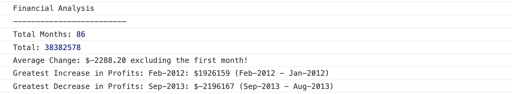

# Console-Finances

## Overview

### In this challenge, we used JavaScript to analysed the financial reocrds of a company by calculating the following:
1) Number of months
2) Total profit/losses 
3) Average changes between the months
4) The minimum and maximum changes and their corresponding months

## Screenshot of analysis:

## URL link to the deployed application
https://stellaa30.github.io/Console-Finances/

## How to Run the code
1) Open the URL link above in Google Chrome
2) Right click and select "Inspect"
3) Click on the console tab to view the JavaScript outputs

 
