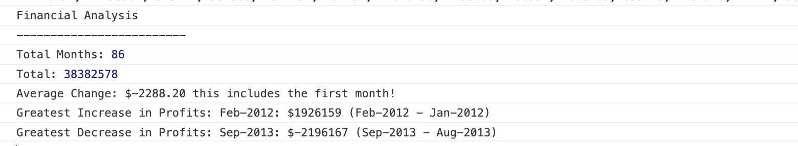

# Console-Finances

## Overview

In this challenge, we analysed the financial reocrds of a company by calculating the following:
1) Number of months
2) Total profit/losses 
3) Average changes between the months
4) The minimum and maximum changes and their corresponding months

## Screenshot of analysis:

 